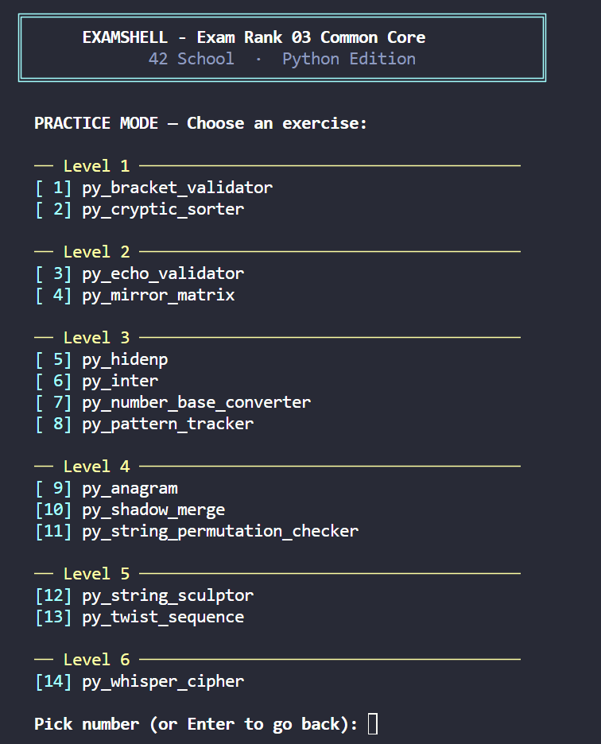

# 🧠 42 Common Core Rank 03 - Python ExamShell & Solutions

<p align="center">
  
</p>

A Python-based **ExamShell simulator** inspired by the new 42 School Common Core Rank 03 exam, combined with a collection of organized solutions grouped by difficulty level.

---

# 🚀 Quick Start

Clone the repository:

```bash
git clone https://github.com/SaraFreitas-dev/42-Python-ExamShell-Rank03
cd RANK_03
```

Run the ExamShell:

```bash
python3 examshell.py
```

You will be presented with the main menu:

```text
[1] Start Exam
[2] Practice Mode
[3] List all exercises
[q] Quit
```
---

## 📝 Workspace

When the ExamShell starts, it automatically creates an `exam_workspace` directory.

All exercise files should be created inside this folder. The grader will only validate solutions placed in the generated workspace.

Example:

```text
exam_workspace/
├── py_echo_validator.py
├── py_shadow_merge.py
└── py_whisper_cipher.py
```

Simply create the requested file, implement your solution, and submit it through the ExamShell interface for automatic evaluation.


---

# ⭐ Main Feature: ExamShell Simulator

The ExamShell is the core of this repository.

It was built specifically to simulate the new Common Core Rank 03 experience and allows students to practice in conditions that are much closer to the real exam than simply reading solutions.

Features include:

- Random exercise assignment
- Progressive level system
- Automatic grading
- Hidden test cases
- Practice mode
- Exam mode
- Colored terminal interface
- Score tracking
- Time tracking
- Rank progression logic
- Pure Python implementation

The workflow mirrors the real exam:

1. Receive a subject
2. Create the requested Python file
3. Implement the solution
4. Submit for grading
5. Fix failing tests
6. Progress to the next level

---

# 🎯 Exam Mode

Select:

```text
[1] Start Exam
```

The simulator will:

- Assign exercises automatically
- Increase difficulty after each successful exercise
- Track your score
- Simulate a 3-hour exam session
- Recreate the Common Core Rank 03 workflow

Each validated exercise awards:

```text
25 points
```

Passing score:

```text
100 / 100
```

---

# 🛠 Practice Mode

Select:

```text
[2] Practice Mode
```

Practice Mode allows you to:

- Choose any exercise
- Focus on a specific level
- Submit unlimited times
- Train without time pressure

---

# 📚 Solutions

Solutions are organized by level and include subjects and completed exercises.

```text
solutions/
├── level_1
├── level_2
├── level_3
├── level_4
├── level_5
└── level_6
```

This makes it easy to study specific difficulty ranges or review previously solved exercises.

---

# 📖 Topics Covered

- Strings
- Lists
- Dictionaries
- Matrices
- Sorting
- Palindromes
- Caesar Cipher
- Anagrams
- Pattern Matching
- Base Conversion
- Array Rotation
- Subsequence Detection
- Algorithmic Thinking

---

# ⚠️ Disclaimer

This project is an independent educational tool inspired by the 42 School exam format.

It is not affiliated with or endorsed by 42 School.

---

# ⭐ Support

If this repository helped you prepare for the exam, consider giving it a star.

Good luck and happy coding 🚀
